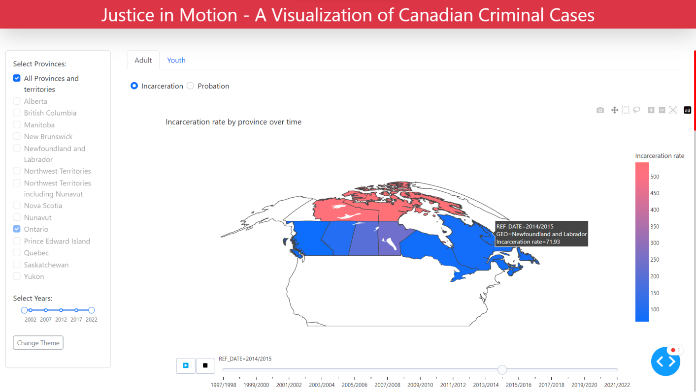

# Justice in Motion - A Visualization of Canadian Criminal Cases

Justice in Motion is a web application that utilizes Python, Pandas, and Plotly Dash to visualize
crime data in Canada. The application provides an interactive platform for users to explore and
analyze crime data across different regions of Canada, with a focus on adult and youth
correctional services. The data for these visualizations were obtained from publicly available
sources such as the Correctional Services of Canada and Statistics Canada.

## Features

- Use the left-hand menu to select the global filters you want to explore.
- Once you have selected your parameters, you can interact with the data visualizations by hovering over the different regions and exploring the data using the various interactive features.
- Use the top navigation bar to switch between different types of data parameters, such as adult data and youth data.
- You can also switch between multiple themes such as light and dark themes by clicking on the theme toggle button located in the left-hand menu.

## Project Structure

The project structure is as follows:

- **/assets**: Contains CSS and JS files for the front end of the web application.
- **/dataset**: Contains CSV files with data related to Canadian correctional services for both adults and youth.
- **.gitignore**: Specifies files and directories that should be ignored by Git.
- **app.py**: The main file of the web application, which runs the server and defines the layout of the front end.
- **controls.py**: Contains helper functions for generating the filters and dropdown menus on the front end.
- **data_adult.py**: Contains the code for generating the visualizations related to adult correctional services.
- **data_youth.py**: Contains the code for generating the visualizations related to youth correctional services.
- **requirements.txt**: Specifies the Python packages required to run the application.

The `app.py` file is the main entry point of the application. It defines the layout of the web page and includes the necessary callbacks to generate the visualizations based on the user's selections. The `controls.py` file contains helper functions for generating the filters and dropdown menus on the front end.

The visualizations for adult and youth correctional services are generated using the `data_adult.py` and `data_youth.py` files, respectively. These files contain functions that use Pandas and Plotly to generate the visualizations based on the selected parameters. The CSV files containing the raw data are stored in the `dataset` directory.

## Usage

To use the app, you can visit the deployed version at [crimeviz.piyushbatra.com](http://crimeviz.piyushbatra.com) (this might be slow as I'm  using free tier instance) or run the app locally on your computer. 

Enjoy exploring the data!